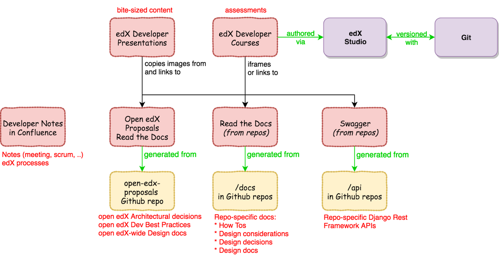

#################################
OEP-0019: Developer Documentation
#################################

+-----------------+--------------------------------------------------------+
| OEP             | :doc:`OEP-0019 </oeps/oep-0019>`                       |
+-----------------+--------------------------------------------------------+
| Title           | Developer Documentation                                |
+-----------------+--------------------------------------------------------+
| Last Modified   | 2018-04-26                                             |
+-----------------+--------------------------------------------------------+
| Authors         | Grant Goodman,                                         |
|                 | Robert Raposa,                                         |
|                 | Nimisha Asthagiri                                      |
+-----------------+--------------------------------------------------------+
| Arbiter         | Albert (AJ) St. Aubin <astaubin@edx.org>               |
+-----------------+--------------------------------------------------------+
| Status          | Draft                                                  |
+-----------------+--------------------------------------------------------+
| Type            | Best Practice                                          |
+-----------------+--------------------------------------------------------+
| Created         | 2018-03-27                                             |
+-----------------+--------------------------------------------------------+
| `Review Period` | <start - target end dates for review>                  |
+-----------------+--------------------------------------------------------+
| `Resolution`    | <links to any discussions where the final              |
|                 | status was decided>                                    |
+-----------------+--------------------------------------------------------+

.. contents::
   :local:
   :depth: 2

Context
-------

Developers who work on the Open edX platform, both inside and outside of edX,
need accurate and current documentation about platform architecture, APIs, and
development best practices.

Developer documentation has been inconsistently and in some cases poorly
maintained. Documents exist on ReadTheDocs (RTD), in repositories on GitHub,
in Confluence, and in Google Docs. Documents are also difficult to find.

This proposal focuses on long-term developer "Documentation" needs and does not
concern itself with any transitory “Notes” that a development team may use for
project management, brainstorming, meeting notes, etc.  We also distinguish
"Documentation" from any useful code "Comments" that a developer may choose
to add to clarify or add rationale to a local code segment. "Comments" are also
out of scope of this OEP.

Decisions
---------

    relationships.  This is further described below.

Agile Documentation Needs
~~~~~~~~~~~~~~~~~~~~~~~~~

With Agile development and Clean Code, we can minimize over-documentation since
code should be readable and self-documenting. Where we do still need developer
documentation is:

1. **Decision Records** to understand the rationale behind the code and the
   evolution of its perceived tech debt.

   * These will be captured in either: (1) the `open-edx-proposals repo`_ for
     system-wide decisions or (2) in `local decisions`_ folders within local code
     repos. The latter may exist in a top-level folder in a repo and also as a
     subfolder of an individual Django app.

2. **Diagrams** to provide a visual holistic perspective of the overall system 
   or component with its boundaries, interconnections, and relationships.

   * These will be stored in Github co-located with the relevant code or text.

3. **How-To Documentation** with step-by-step instruction in enabling and using
   a feature.

   * These will be stored in Github co-located with the relevant code.

4. **API Documentation** with information on interfaces for integrating with or
   enhancing the platform. These should be automatically generated, as possible.
   Some examples are:

   * REST API interfaces will be automatically generated using Swagger_.
   * The Open edX Learning Exchange (OLX) format should be automatically generated.
   * Plugin interfaces (e.g., Proctoring tool) should be automatically generated
     using Sphinx_.

.. _open-edx-proposals repo: https://github.com/edx/open-edx-proposals
.. _local decisions: https://github.com/edx/edx-platform/tree/master/openedx/core/djangoapps/oauth_dispatch/docs/decisions
.. _Swagger: https://swagger.io/
.. _Sphinx: http://www.sphinx-doc.org/en/master/

Tools and Location
~~~~~~~~~~~~~~~~~~

The recommended tools and locations for developer documentation are described
below, inlined with the requirements they meet.

* **Discoverable**. Users must be able to find the documentation that is
  relevant to their needs. This calls for a high-level index and search
  mechanism for finding content. 

  * **Search**. For the time-being, we will make use of Google and Github's
    search functionality for finding content since all developer documentation
    will be in Github.  Certain IDEs may also have good tools for searching. 
    
  * **Index**. In the future, we will invest time in a better indexing
    tool to aggregate and structure the documentation. This OEP will be
    updated with more information at that time.

* **Maintainable**. Writers, editors, and reviewers should be able to
  create and modify documentation without too much effort. Anyone, inside
  or outside of edX, should have the ability to contribute to documentation.

  * **Co-located**. The closer the documentation lives with its corresponding
    code, the more likely it will be kept up-to-date.

    * Repo-specific documentation will live within a "docs" folder within
      its repo. This includes local "decisions", "how-tos", and README.rst.
      Documentation should not live within the code itself (e.g., an __init__.py
      python file).
    
    * System-wide documentation will live within the "open-edx-proposals" repo.

  * **Exported Diagrams**. In order to keep diagrams updated across time, they
    will need to be exported from whichever tool they were created in, with the
    exported version maintained in Github.
    
    * draw.io diagrams can be exported and imported as XML files.
    * Lucidchart diagrams can be exported and imported as Visio (VDX) files.

* **Version Controlled**. Documentation should be maintained under version
  control in Github, for the following reasons:

  * **Reviewed**. They will be properly reviewed as defined by that repo's
    process.

  * **Tagged**. They will be appropriately in-synch with its corresponding
    code. So when an open edX instance is running a specific named release,
    they can refer to the matching documentation for that version of the
    codebase.

  * **Source Controlled**. All the other advantages of having source-control
    backed files, including sharing across multiple developers and robust
    storage.

Format
~~~~~~

We will use `Restructured Text (RST)`_ for all developer documentation.

Note: we are not embracing `Markdown (MD)`_.  Please see this blog post on
`why rST over Markdown for documentation`_.

For RST, you can use the following tools:

* `Visual Studio Code`_ works pretty well.
* `Online reStructured Text editor`_ helps, but isn't perfect.
* `Online table generator`_ (supports multiple formats)
* `Pandoc`_ can be used to convert between many formats, like Google Doc to rST.
* Other options are listed on stackoverflow_.

The `reStructuredText (rST) Primer`_ can be a good reference.

.. _Restructured Text (RST): http://docutils.sourceforge.net/rst.html
.. _Markdown (MD): https://www.markdownguide.org/
.. _why rST over Markdown for documentation: http://ericholscher.com/blog/2016/mar/15/dont-use-markdown-for-technical-docs/
.. _Visual Studio Code: https://marketplace.visualstudio.com/items?itemName=tht13.rst-vscode
.. _Online reStructured Text editor: http://rst.ninjs.org/
.. _Online table generator: http://truben.no/table/
.. _Pandoc: https://pandoc.org/
.. _stackoverflow: https://stackoverflow.com/a/2747041
.. _reStructuredText (rST) Primer: http://www.sphinx-doc.org/en/master/usage/restructuredtext/basics.html

edX Developer Course
~~~~~~~~~~~~~~~~~~~~

As depicted in the diagram above, we will dogfood our open edX features and 
tools to create a maintained edX course for open edX developers. This course 
will function as both an onboarding tool and an ongoing reference library for
open edX developers.

The edX course will reference developer documentation and diagrams persisted in
Github and provide assessments to help the learner digest and retain the
material.

For ongoing maintainence of the edX course, it will be integrated with Git. To
dogfood our tools, the course will be authored in Studio.

Backward Compatibility
~~~~~~~~~~~~~~~~~~~~~~

We will need to migrate content from deprecated sources such as Confluence. As
part of the migration, we will need to establish a timetable for deleting
migrated content and determine a method for redirecting users to the new
location of the content.

Future considerations
---------------------

* Use `Algolia`_ for search.

.. _Algolia: http://algolia.com/
