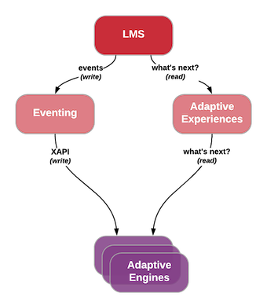

==========================
OEP-0026: xAPI Integration
==========================

+-----------------+--------------------------------------------------------+
| OEP             | :doc:`OEP-0026 </oeps/oep-0026-arch-xapi-integration>` |
+-----------------+--------------------------------------------------------+
| Title           | xAPI Integration                                       |
+-----------------+--------------------------------------------------------+
| Last Modified   | 2018-07-11                                             |
+-----------------+--------------------------------------------------------+
| Authors         | Nimisha Asthagiri <nimisha@edx.org>                    |
+-----------------+--------------------------------------------------------+
| Arbiter         | TODO                                                   |
+-----------------+--------------------------------------------------------+
| Status          | Under Review                                           |
+-----------------+--------------------------------------------------------+
| Type            | Architecture                                           |
+-----------------+--------------------------------------------------------+
| Created         | 2018-07-11                                             |
+-----------------+--------------------------------------------------------+
| `Review Period` | 2018-07-11 - 2018-08-28                                |
+-----------------+--------------------------------------------------------+

.. contents::
   :local:
   :depth: 2

Context
-------

Adaptive Learning
=================

As captured in the `Adaptive Learning Presentation`_, adaptive learning in Open edX 
will enable the platform to respond to a learner's interactions in real-time, 
automatically providing the learner with individualized support.  Data analysis 
from earlier experimental attempts on edX.org and elsewhere show how adaptive 
learning mechanisms can significantly improve the learner's efficiency, engagement, 
and retention, while providing a more effective learning experience with metacognitive
support for life-long learning.

.. _Adaptive Learning Presentation: https://openedx.atlassian.net/wiki/spaces/AC/pages/641105978/Adaptive+Learning+Presentation

Integration with Adaptive Engines
=================================

As an iterative path to this future, the immediate goal is to enable integrations with
external adaptive engines.  In the far future, we may also implement our own open-sourced
adaptive engines.  But in the meantime, we would like to establish standard APIs
that (1) adaptive engines can use to receive real-time events from the Open edX LMS and
(2) the Open edX LMS can use to query adaptive engines on what to present to learners.
This document focuses on #1 with the need for scalable and real-time updates to adaptive
engines. This is depicted by the left-hand flow in the diagram below.

    events to an intermediary "Eventing" component, which forwards those events to adaptive
    engines. The right-hand side shows how the Open edX LMS queries the adaptive engines for
    "what's next" via an intermediary "Adaptive Experiences" component.

Integration with Other External Systems
=======================================

It is worthwhile to note that although the context and immediate requirements pertain to
adaptive learning needs, the general framework for real-time notifications of Open edX LMS
events can potentially be used by other external systems as well. However, for the time being,
we will focus our efforts on the needs for adaptive learning, while keeping in mind that the
technology and framework could potentially be extended and reused.

Technical Specification
-----------------------

Standardized Integration with xAPI
==================================
In order to enable a plug-n-play ecosystem with various adaptive engines, we will
use the ADL_ standard `Experience API (xAPI)`_ as the communication protocol between
the Open edX LMS and registered adaptive engines. We have chosen xAPI since it has
`widespread industry support and usage`_ for tracking and analyzing learning activity.
Please see `xAPI Architecture Overview`_ for further information on xAPI.

.. _ADL: https://adlnet.gov/
.. _Experience API (xAPI): https://www.adlnet.gov/research/performance-tracking-analysis/experience-api/
.. _widespread industry support and usage: https://xapi.com/adopters/
.. _xAPI Architecture Overview: https://www.adlnet.gov/research/performance-tracking-analysis/experience-api/xapi-architecture-overview/

Learning Record Store (LRS) - Future
====================================

xAPI includes specification for a Learning Record Store (LRS), which encapsulates a
data store with APIs for storing and accessing xAPI data. While an LRS could be used
for many different purposes, it can be used to train adaptive engines as shown in the
diagram below.

    from the Open edX "Eventing" component and is accessed by adaptive engines for
    training purposes, using xAPI for both transactions.

In the short term, however, we will not implement our own LRS since the initial integration
efforts do not require this (as shown in the first diagram above).

Statement API
=============

xAPI specifies 4 standard REST-ful JSON payload APIs, of which only the `Statement API`_
is needed for our purposes as that API is sufficient for tracking learning activity.

The Statement API has essentially the following parts: `xAPI Actor`_, `xAPI Verb`_,
`xAPI Object`_, `xAPI Context`_, and `xAPI Result`_.

.. _Statement API: https://xapi.com/statements-101/

xAPI Actor
~~~~~~~~~~
Although the **Actor** field can be either an *Agent* or a *Group*, we will primarily
support only the *Agent* type, which is used for individuals performing an activity
(`xAPI Verb`_ on an `xAPI Object`_).

An Actor can be identified using `Friend of a Friend (FOAF)`_ vocabulary with either:
(1) `email address`_, (2) `hash of email address`_, (3) `OpenID URI`_, or (4) `account`_
with a *homepage*-scoped identifier.  One of these is sent along with the Actor's "name".
To be mindful of learner privacy, we will initially take a conservative approach
and only send #3, with an Open edX anonymized unique identifier of the learner
(`Anonymized User ID`_).

In the future, if certain external systems require `Personally Identifiable Information
(PII)`_, like the learner's email address or name, then those may be conditionally sent
with appropriate permissions. Adaptive engines, however, do not need PII.

Initially, we will exclude the "name" field. However, if we find that xAPI JSON parsers
assume this field always exists, then we can include the field but provide a non-PII
value, such as a copy of the `Anonymized User ID`_.

Anonymized User ID
^^^^^^^^^^^^^^^^^^
An *Anonymized User ID* will be generated as a SHA-256 hash of the Open edX user_id, 
which is the **id** value of the user's row in the `Django auth_user`_ table in the
Open edX LMS.

As mentioned in `Using consistent user identifiers in Segment events`_, the other user
identifiers in the Open edX platform aren't perfectly suited for inclusion in externally
sent events:

.. list-table::
   :header-rows: 1

   * - Identifier
     - Limitations
   * - username
     - Often contains PII, such as user's name or year of birth.
   * - LMS user_id
     - Information leakage of auth_user table with easily guessable values; tied down
       to implementation of the housing database.
   * - email address
     - Is PII and modifiable by the user.
   * - anonymous user_id
     - It is currently constructed by hashing the user's LMS user_id with the Django
       server's *SECRET_KEY* value. This value will change when the *SECRET_KEY* is rotated.

.. _Django auth_user: https://docs.djangoproject.com/en/2.0/topics/auth/default/#user-objects

Example
^^^^^^^

Here is an example of an **Actor** JSON value that we would generate:

::

    "actor": {
        “objectType”: “Agent”,
        “openid”: “openedx.org/users/user-v1:<anonymized-user-id>”,
        "name": “openedx.org/users/user-v1:<anonymized-user-id>”  # only include this field if necessary
    }

See `Deep Dive: Actor/Agent`_ for more information on xAPI Actors.

.. _Friend of a Friend (FOAF): http://xmlns.com/foaf/spec/
.. _email address: http://xmlns.com/foaf/spec/#term_mbox
.. _hash of email address: http://xmlns.com/foaf/spec/#term_mbox_sha1sum
.. _OpenID URI: http://xmlns.com/foaf/spec/#term_openid
.. _account: http://xmlns.com/foaf/spec/#term_account
.. _Personally Identifiable Information (PII): https://en.wikipedia.org/wiki/Personally_identifiable_information
.. _Using consistent user identifiers in Segment events: https://openedx.atlassian.net/wiki/spaces/AN/pages/144441849/Using+consistent+user+identifiers+in+Segment+events
.. _`Deep Dive: Actor/Agent`: https://xapi.com/deep-dive-actor-agent/

xAPI Verb
~~~~~~~~~

The **Verb** in xAPI is a past tensed value, identified by a URI from the `xAPI registry`_
and paired with a short display string. It denotes the action that was performed by the
Actor on the Object in the statement. We will use only values found in the registry and
document which values are used for which edX events in the `Open edX Events`_ section below.

The registry is automatically created from multiple profiles. For now, we will limit
ourselves to only URIs prefixed by the following domains, in the following priority
order (in case of conflicting names):

* http://adlnet.gov
* http://w3id.org
* http://id.tincanapi.com

If, by any chance, a verb needed by Open edX does not exist in the registry, then we
will create a pull request to recommend adding it to the `central github repository of
xAPI Profiles`_. 

Here is an example of a **Verb** JSON value that we would generate:

::

    "verb": {
        "id": "http://adlnet.gov/expapi/verbs/answered",
        "display": { 
            "en-US": "answered"
        }
    }

See `Experience API Deep Dive: Verbs`_ for more information on xAPI Verbs.

.. _xAPI registry: http://xapi.vocab.pub/verbs/index.html
.. _central github repository of xAPI Profiles: https://github.com/adlnet/xapi-authored-profiles
.. _`Experience API Deep Dive: Verbs`: https://xapi.com/deep-dive-verb/

xAPI Object
~~~~~~~~~~~

Initially, the **Object** in an Open edX xAPI event will be an xAPI *Activity*, which is
uniquely defined by a URI. (In the future, we may expand Objects to also be Actors in case
of *social interactions*, and Statements in case of *voiding*.)

The **id** field is a unique identifier. The `Open edX Events`_ section has specifics on
which Open edX identifier is used in each event.

The **type** of the Activity and the **name** of the Activity are included in the
**definition** field.  Similar to Verbs, the type of the Activity is a standard URI
taken from the `xAPI registry`_.

Here is an example of an **Object** JSON value that we would generate:

::

    "object": {
        "id": "https://courses.openedx.org/xblock/block-v1:openedx+origami-folding+1T2018+type@problem+block@abcd",
        "definition": {
            "type": "http://adlnet.gov/expapi/activities/question",
            "name": { 
                "en-US": "Question on mountain fold needed to create an origami crane base",
            }
        }
    }

See `Deep Dive: Object`_ for more information on xAPI Object.

.. _`Deep Dive: Object`: https://xapi.com/deep-dive-object/

xAPI Context
~~~~~~~~~~~~

The **Context** field allows us to embed additional contextual information in each statement.
See specifics in the `Open edX Events`_ section below since it varies by event type.

Here is an example of a **Context** JSON value that we would generate:

::

    "context": {
        "registration": "openedx.org/enrollments/enrollment-v1:<anonymized-enrollment-id>",
        "contextActivities": {
            “parent”: [{
                “objectType”: “Activity”,
                “id”: “https://openedx.org/courses/course-v1:openedx+origami-folding+1T2018"
            }]
        }
    }

See `Deep Dive: Context`_ for more information on xAPI Context.

.. _`Deep Dive: Context`: https://xapi.com/deep-dive-context/

xAPI Result
~~~~~~~~~~~

The **Result** field specifies the score the user earned on an activity.  Here is an
example of a JSON value that we would generate for a problem type:

::

    "result": {
        "success": false,
        "completion": true,
        "score": {
            "min": 0,
            "max": 50,
            "raw": 10,
            "scaled": .20
        }
        "response": "foo"
    }

See `Deep Dive: Result`_ for more information on xAPI Result.

.. _`Deep Dive: Result`: https://xapi.com/deep-dive-result/

Open edX xAPI Plugin
====================

A new library will be implemented, using the Open edX `Django App Plugin`_ design pattern,
that:

1. Translates Open edX native events to Open edX xAPI events (**Translator**).
2. Validates the generated event using a general-purpose validation library 
   cross-maintained by Open edX xAPI consumers (**Validator**).
3. Routes real-time xAPI events to all registered consumers (**Router**).
4. Provides an administration interface to configure and manage registered
   consumers (**Admin**).

Translator
~~~~~~~~~~

This component will plug into the `Open edX Event Tracking`_ subsystem to listen to
events of interest and translate them to xAPI's JSON format.

TBD - The development team will assess whether we should use (and start owning)
the already implemented (but no longer maintained) `xAPI Python Open Source Library`_. 

Validator
~~~~~~~~~

The intention of this validation component is to ensure we continue to support the
expected xAPI formats by all participating Open edX xAPI consumers. In many ways,
this is similar to what `consumer-driven contract testing`_ would enable and uses
similar design principles. Essentially, a common validation library can be
collaboratively maintained by participating consumers, including consuming adaptive
engines. This ensures an end-to-end integration that can be maintained going forward.

**Note**: Although xAPI specifies a standardized format, it is a low-level transaction
schema and relies on higher-level "profiles" applied on top of it. So the profiles
for specific Activities, Verbs, Contexts, etc used by Open edX need to be contractually
maintained.
 
Router
~~~~~~

The router forwards xAPI events to interested consumers.  The complexity of this
component may increase over time as we support higher degrees of customization by consumers,
such as filtering for only certain types of events and varying degrees of permissions
of access to activities.

For the first iteration, we need the following permissions:

* **Course restriction** - certain consumers can access events only in certain courses.

In the future, we may need the following:

* **User restriction** - certain consumers can access all events for certain users.
* **Site restriction** - certain consumers are limited to accessing events of certain sites.
* **Activity type restriction** - certain consumers can access only certain types of events.

Admin
~~~~~

The administration component is responsible for allowing the Open edX site administrator
to configure the list and permissions of registered xAPI event consumers.

Eventually, the registry of consumers may become a self-service portal where consumers
may initiate their request for access. However, initially, this can be a simple interface,
possibly implemented in Django Admin.

.. _Open edX Event Tracking: https://github.com/edx/event-tracking
.. _Django App Plugin: https://github.com/edx/edx-platform/blob/master/openedx/core/djangoapps/plugins/README.rst
.. _xAPI Python Open Source Library: https://xapi.com/python-library/
.. _consumer-driven contract testing: https://www.thoughtworks.com/radar/techniques/consumer-driven-contract-testing

Decisions & Consequences
------------------------

* **Choice of xAPI** - Although other standard alternatives exist for communication of
  real-time events, such as `IMS Global`_'s `Caliper Sensor APIs`_, business research
  found xAPI to be a more widely used standard at this time. This work does couple us
  to xAPI-based integrations, but the underlying framework and integration points in
  the system can remain agnostic to the communication protocol.

  Note that this also means the Open edX system is embracing standards from two
  different bodies, as it continues to use `IMS Global`_'s LTI_ standard as it's
  underlying Content Launch integration standard, while using ADL_'s xAPI standard.

* **Emphasis on user privacy** - We are initially taking a conservative approach by
  minimizing the PII that is sent to xAPI consumers. The trade-off is that consumers
  may find the received user identifiers limiting. However, at this time, it's unclear
  whether adaptive engines, which are written generically for all users, need PII to
  be effective. They need the ability to bind events together and track pathways and
  progress for users, but they can do so with any unique identifier - hence the
  introduction of the `Anonymized User ID`_.

  Enterprises and other organizations may want to use this xAPI integration framework
  to access data for their users. For those use cases, sharing PII may be required.
  We have chosen to keep those use cases in mind, but not target them initially, with
  the understanding that future work would be needed to address those needs.

* **Deferring implementation of an LRS** - As mentioned above, we are consciously
  postponing implementation of an Open edX specific LRS at this time. Although the
  need for an LRS may be forthcoming, this initial iteration defers this work.

  As a consequence, adaptive engines may need to maintain their own LRS if they need
  to refer back to previous events. Given our business research to date, it seems
  many adaptive engines are already maintaining their own custom-optimized storage
  of event data.

.. _IMS Global: https://www.imsglobal.org/
.. _Caliper Sensor APIs: https://www.imsglobal.org/caliper-analytics-v1-public-repos-sensor-apis
.. _LTI: http://www.imsglobal.org/activity/learning-tools-interoperability

Open edX Events
---------------

Currently, the Open edX system supports and maintains events that are sent to tracking
logs, as described in `Tracking Log Events`_.

Prioritized List of Events
==========================

For this first iteration, we will focus primarily on the following events:

- **Enrollment events**

  + `edx.course.enrollment.activated <http://edx.readthedocs.io/projects/devdata/en/latest/internal_data_formats/tracking_logs/student_event_types.html#edx-course-enrollment-activated-and-edx-course-enrollment-deactivated>`_.
       Whenever a learner enrolls in a course.
  + `edx.course.enrollment.deactivated <http://edx.readthedocs.io/projects/devdata/en/latest/internal_data_formats/tracking_logs/student_event_types.html#edx-course-enrollment-activated-and-edx-course-enrollment-deactivated>`_.
       Whenever a learner unenrolls from a course.

- **Problem interaction events**

  + `edx.grades.problem.submitted <http://edx.readthedocs.io/projects/devdata/en/latest/internal_data_formats/tracking_logs/course_team_event_types.html#edx-grades-problem-submitted>`_.
      Whenever a learner submits any problem.
  + `problem_check <http://edx.readthedocs.io/projects/devdata/en/latest/internal_data_formats/tracking_logs/student_event_types.html#problem-check>`_.
       Whenever a learner's answer to a problem is checked.
  + `showanswer <http://edx.readthedocs.io/projects/devdata/en/latest/internal_data_formats/tracking_logs/student_event_types.html#showanswer>`_.
       Whenever a learner is shown the answer to a problem.
  + `edx.problem.hint.demandhint_displayed <http://edx.readthedocs.io/projects/devdata/en/latest/internal_data_formats/tracking_logs/student_event_types.html#edx-problem-hint-demandhint-displayed>`_.
       Whenever a learner requests a hint to a problem.

- **Video events**

  + `edx.video.loaded <http://edx.readthedocs.io/projects/devdata/en/latest/internal_data_formats/tracking_logs/student_event_types.html#load-video-edx-video-loaded>`_.
       Whenever a learner loads a video.
  + `edx.video.played <http://edx.readthedocs.io/projects/devdata/en/latest/internal_data_formats/tracking_logs/student_event_types.html#play-video-edx-video-played>`_.
       Whenever a learner plays a video.
  + `edx.video.stopped <http://edx.readthedocs.io/projects/devdata/en/latest/internal_data_formats/tracking_logs/student_event_types.html#stop-video-edx-video-stopped>`_.
       Whenever a learner stops a video.
  + `edx.video.paused <http://edx.readthedocs.io/projects/devdata/en/latest/internal_data_formats/tracking_logs/student_event_types.html#pause-video-edx-video-paused>`_.
       Whenever a learner pauses a video.
  + `edx.video.position.changed <http://edx.readthedocs.io/projects/devdata/en/latest/internal_data_formats/tracking_logs/student_event_types.html#seek-video-edx-video-position-changed>`_.
       Whenever a learner navigates to a different position in a video.

- **Course navigation events**

  + `edx.ui.lms.sequence.outline.selected <http://edx.readthedocs.io/projects/devdata/en/latest/internal_data_formats/tracking_logs/student_event_types.html#edx-ui-lms-outline-selected>`_.
       Whenever a learner navigates to a subsection in the course.
  + `edx.ui.lms.sequence.next_selected <http://edx.readthedocs.io/projects/devdata/en/latest/internal_data_formats/tracking_logs/student_event_types.html#example-edx-ui-lms-sequence-next-selected-events>`_.
       Whenever a learner navigates to the next content in the course.
  + `edx.ui.lms.sequence.previous_selected <http://edx.readthedocs.io/projects/devdata/en/latest/internal_data_formats/tracking_logs/student_event_types.html#edx-ui-lms-sequence-previous-selected>`_.
       Whenever a learner navigates to the previous content in the course.
  + `edx.ui.lms.sequence.tab_selected <http://edx.readthedocs.io/projects/devdata/en/latest/internal_data_formats/tracking_logs/student_event_types.html#edx-ui-lms-sequence-tab-selected>`_.
       Whenever a learner navigates to another unit within a subsection.
  + `edx.ui.lms.link_clicked <http://edx.readthedocs.io/projects/devdata/en/latest/internal_data_formats/tracking_logs/student_event_types.html#edx-ui-lms-link-clicked>`_.
       Whenever a learner clicks on any link in the course.

.. _Tracking Log Events: http://edx.readthedocs.io/projects/devdata/en/latest/internal_data_formats/tracking_logs/index.html

Event Field Mapping
===================

Please see the `Open edx xAPI Events`_ document for a detailed view of the mapping
between the above Open edX events and their equivalent Open edX xAPI formats.

.. _Open edx xAPI Events: https://docs.google.com/spreadsheets/d/1Qx-1NkpCHXkWh8AagwHD5vzyBCdRXQVof10Ent_EDms/edit?usp=sharing

Open Questions
--------------
* Shall we use OAuth Scopes for Permissions?
